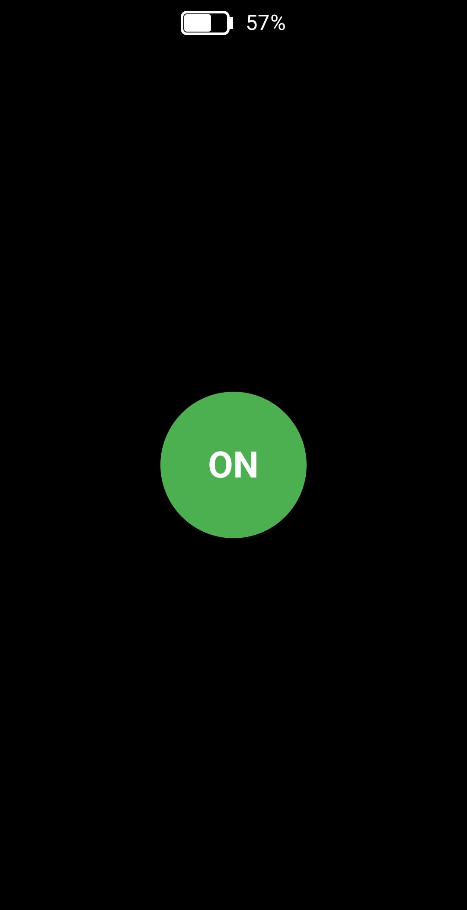

<h1 align="center">Simple Flashlight</h1>

Simple android flashlight app on jetpack compose📱🔦.

## 🖼️Gallery(in light/dark themes)

<table>
    <tr>
        <td>
            
        </td>
        <td>
            
        </td>
        <td>
            
        </td>
    </tr>
</table>

## Android versions🔃
Android 8.0 and later.

## Tech stack📚
* Jetpack Compose
* Accompanist

## Features🌟
* runtime permission check✅
* battery level control🪫 *(flashlight turns off when the battery is low)*
* synchronization with the phone flashlight state from the outside📱
* camera flashlight feature support check📸🔍

## How it works?📃
When launched, the application checks for flashlight support on the phone's camera, then if it is present (otherwise, a screen is displayed informing that it is not supported), it grants camera permission using the **Accompanist** library. Then, if permission is granted, a **torch callback** (to synchronize the flashlight's state if the flashlight was turned on externally) and a **battery charge broadcast receiver** (which monitors the battery level) are registered. Afterward, the user can turn the flashlight on and off. When the battery level is low (approximately **5%** or less), flashlight will turn off and the app will notify the user.